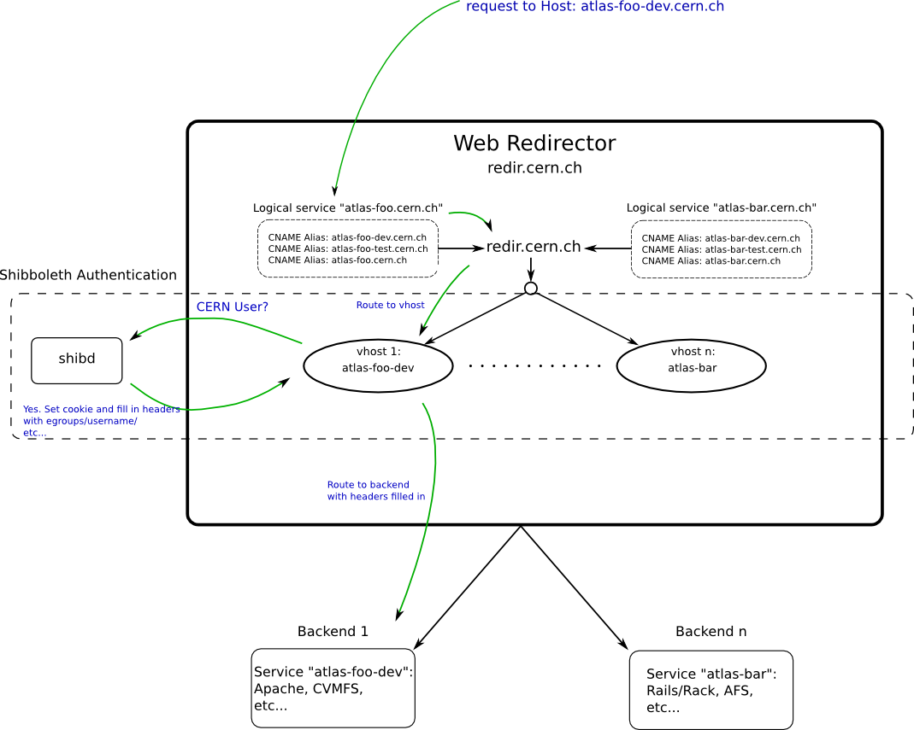

ifdef::env-github[:outfilesuffix: .adoc]

Agile Infrastructure Web Hosting
================================

A new architecture is being set up to aid service-owners in migrating their
code to the new Agile Infrastructure at CERN. One of the major goals of the
"Agile" infrastructure is to migrate to full configuration management, and
leverage this effort to achieve reproducibility and consistency. There is also
an upgrade to SLC 6.x implied in this migration.

:toc:
:toc-placement: preambe

Deployment Methods
------------------

. link:deployment/git{outfilesuffix}[Git Deployment]
. link:deployment/rpm{outfilesuffix}[RPM Distribution]

Introduction
------------

The idea is to factor the common configuration out of different services and
provide a base platform that has most of what a service provider needs to get
started.

Part of the effort involves migrating to a more standard configuration. The
purpose of the redirector is to move the security and authentication to a layer
beyond where the applications need to worry about it. On the backend, the
web server will run as a standard 'apache' user, and it will be configured with
the standard system-paths (/etc/httpd/*, /var/www, etc...).

In order to accomplish the above goals, the deployment procedure for your code
will have to be come more formalized. This means that your application's
development model will have to become stricter. There will be several deployment
methods available, from RPM packages to a git-based deployment model (see
<<deployment-methods,Deployment Methods>> for more details)

As much as is possible, you should try to use OS-provided versions of tools and
frameworks to simplify the distribution and configuration of the service. If you
need newer versions of tools or frameworks, please see to it that you ship these
along with your application or provide a method of easily distributing them (
updated RPMs for example).

Since the document-root of your application should be fully managed, please
ensure that this is fully self-contained. Any state that your application needs
to keep on the machine should be put somewhere outside the application code
itself (this separation of code and data is general good practice anyway -- but
here it becomes necessary). Places to store data or state can be created by
puppet and left for your application to populate.

Broad Strategy
~~~~~~~~~~~~~~

In the broadest sense, the process of migrating to the AI will consist of four
main steps.

. Define your service's dependencies and configuration requirements and
  communicate them to the person helping the migration (please see
  link:questionnaire{outfilesuffix}[this questionnaire] to start)
. Work towards having the configuration management system provide everything
  you need to run your application -- this is an iterative process that will
  involve back-and-forth communication.
. Deploy your service for real and cut over the name from the old to the new.

Architecture
------------

There will be one or more ATLAS web redirectors acting as proxies to a backend,
where your application will live. The proxy will be configured with CERN
Single-Sign-On (SSO) authentication, meaning that your application will not
have to worry about authentication if you are willing to allow people with a
valid CERN account access it.

If your needs are more complicated than that there are methods available,
discussed below in the Authentication section.

Architecture Detail
~~~~~~~~~~~~~~~~~~~

Each service will be allocated three backend machines -- a development
instance, a testing and integration instance, and a production instance. There
will be three URLs on the proxy pointing to these backends,
<servicename>-dev.cern.ch, <servicename>-test.cern.ch, and the production one,
just <servicename>.cern.ch.

[qanda]
Won't this mean that my service will need to be URL-agnostic?::
	Yes, it will. All internal links should not include the full URL of your
	application. Obviously, external links need to and this is OK.

You will have full access--including sudo/root access--to the development
instance. The machine will be puppet-configured to start but configuration
management will then be turned off and you can make any necessary changes.

Once your service is working on the new hardware, we can begin translating the
dependencies into configuration management templates. Most configuration (apache
configuration, necessary packages, filesystems, etc...) will be managed by
puppet.

On the integration / test instance you will be able to log in and make changes
but puppet will be running and hopefully your application will mostly be

The idea is to proceed in the migration as follows:

. Log into the development instance and make your application work behind the
	web redirector.
+
	Keep notes of what configuration was done, i.e. which packages were
	installed what apache configuration was done, etc...

. Enable your code to be deployed automatically, via one of the supported
	deployment methods (see <<deployment-methods,deployment methods>>) (rpm,
	git, link, etc..)
+
	This will consist of either building an RPM package, placing your code into
	git, or some other method.

. Send a summary of the steps needed to deploy your application to the contact
	coordinating this migration. They will put your configuration into puppet
	as much as is possible.
+
	On the test / integration instance your application
	will be deployed via the automatic method chosen above. The configuration
	will be tested and once it is working you proceed to the production
	instance. You will have access to this machine to help fix and debug issues
	with the automatic deployment.

. Apply the correct configuration management template to the production
	instance. Your application should be deployed correctly, and once we verify
	that it is so, we will switch the DNS name of the production service to be
	an alias to the proxy and you are done!

Because the deployment is to be automated, everything under the document-root
should be static, no application state or data should be placed there.

[qanda]
Where do I put data my service creates?::
	If your application needs to manage state, just simply use another directory
	not directly under the docroot of the site. Let the person know where this data
	is and how much data you expect to create and it can be incorporated into
	the puppet templates.

Due to the limited size of OpenStack images, storage requirements beyond a few
gigabytes necessitate the creation of a separate data volume to be mounted on
the machine where your service runs.

Technical Information for Service Maintainers
---------------------------------------------

The IP addresses of each instance will be CNAME aliases that map to the
web-redirector. The redirector will run apache with a virtual host for each
instance of your application.  The backend will run a firewall that will
restrict requests on web-ports to the redirector so no direct access will be
possible.

Authentication
~~~~~~~~~~~~~~

CERN's Shibboleth (SSO) instance will authenticate on the proxy and pass the
username and group-list to the backend via some HTTP headers, thus allowing
your application to do finer-grained access control if you so desire.

The variables that will be passed to the backends are listed below

HTTP_CERN_USER::
	The username that the person logged into SSO with
HTTP_CERN_EGROUPS::
	A semicolon-separated list of EGroups that the user is a member of.
HTTP_CERN_FULLNAME::
	The user's full name as registered with at CERN.
HTTP_CERN_EMAIL::
	The user's email address

The USER, FULLNAME, and EMAIL are what the user is registered as at CERN. The
*HTTP_CERN_EGROUPS* variable is a large, semicolon-delineated list of EGroups
the user belongs to, like this for example:

-----
Domain Users; Twiki Atlas web ;ca-allowed-user-certificate;atlas-dev-gen;
NICE Profile Redirection;CMF_NSC_863 Users;ph-dep-all;
ca-allowed-user-certificate-mp;NICE Enforce Password-protected Screensaver;
NICE CERN CA Use WebService;users-northamerica;atlas-computing;
Twiki Users;atlas-readaccess-main;it-service-backup-tsm512;
CERNTS-cerntscms-users;Users Other;atlas-adc-central-services;
hostel-notcernmembers;VOBox-Admins-ATLAS;young-at-CERN;CERN Users;zp;
NICE CERN CA Create Host Certificates;all-users-at-cern;atlas-test-active-1;
service-zephyr-messages;ggo-test;info-newphysics-workshop;all-cern-users;
Users by Home CERNHOMEW;atlas-readaccess-active-members;
it-dep-exp-meeting-members;atlas-adc-service-managers;castor-announce-atlas;
it-mac-users;users-nms;atlas-adc-ddm-lxvoadm-admins; <etc, etc...>
-----

CGI Script
^^^^^^^^^^

In your CGI script you can access these variables in the environment, just like
you would *REMOTE_USER* or any other standard variable.

For example, you can parse the EGroup list from a CGI script as follows
(python example):

----
def in_egroup(group_name):
    """ Return true if user is in EGroup named @group_name """

    return group_name in os.environ['HTTP_CERN_USER'].split(';')

----

PHP Script
^^^^^^^^^^

These variables are available from a PHP webpage in the
http://php.net/manual/en/reserved.variables.server.php[$_SERVER] variable in the
top-scope of your PHP script.

Here is a silly example of validating a user in PHP:

-------
if(strcmp("wstrecke", $_SERVER['HTTP_CERN_USER']) === 0) {
        echo "<b> You are authenticated </b>";
}
-------

