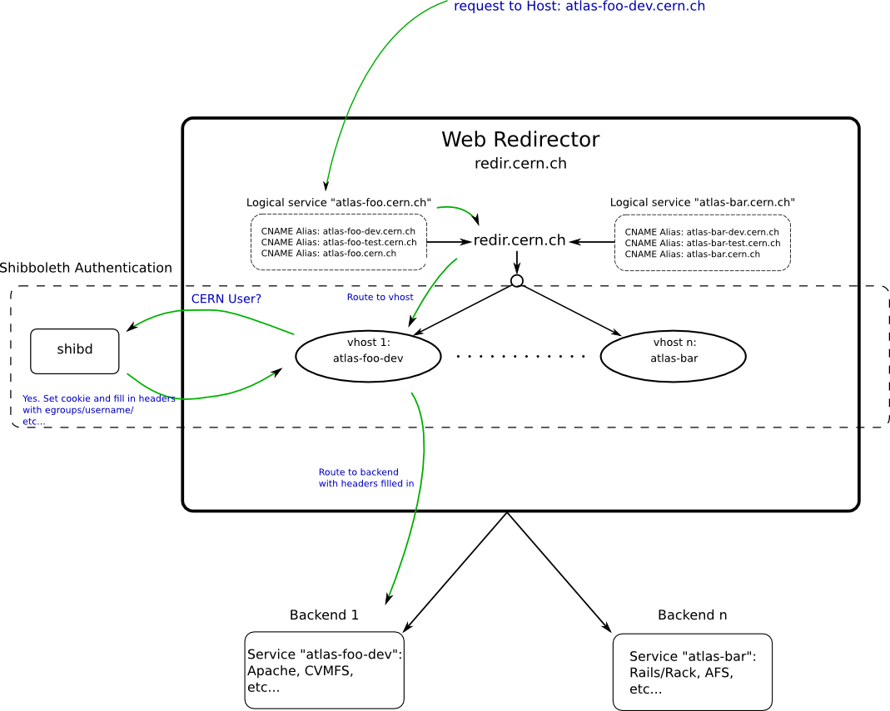

ifdef::env-github[:outfilesuffix: .adoc]

Web Redirector Admin Guide
==========================

The web architecture is best explained by a picture:

Sections
--------

. link:admin/redirector{outfilesuffix}[Web Redirectors]
. link:admin/backends{outfilesuffix}[Backend Services]

Puppet Architecture
-------------------

Because I needed to use a newer https://git.cern.ch/web/it-puppet-module-apache.git/shortlog/refs/heads/upstream_sync[
upstream branch] of the puppetlabs-apache repo (hosted at CERN), I created a
separate environment for the redirector nodes called
https://git.cern.ch/web/it-puppet-environments.git/blob/HEAD:/aweb_prod.yaml[aweb_prod] (and
https://git.cern.ch/web/it-puppet-environments.git/blob/HEAD:/aweb_test.yaml[aweb_test]),
which maps to the ai_prod and ai_test branches of the voatlasmisc repo.

These environments only differ from master in that they are subscribed to
different apache and shibboleth branches upstream.

There is one further "hidden" aspect in puppet -- the use of node-wide
parameters set in foreman. If you, for example, go to a foreman host (like
https://judy.cern.ch/hosts/aiatlas132.cern.ch[aiatlas132]), and click "Edit",
you can click the "Parameters" tab and scroll to the bottom. Here you'll see
a parameter "web_instance_type" set to "prod". This parameter is described
in further detail in the backend docs link:admin/backends{outfilesuffix}[here]
under the section describing volume management.

